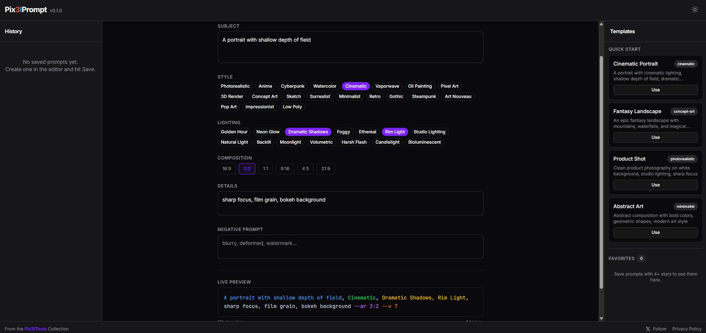

# Pix3lPrompt

An intelligent prompt editor for AI image, video and audio generators. Craft, optimize and manage prompts for Midjourney, Flux, Stable Diffusion, DALL-E, Kling, Runway, Suno and more — all from your browser.



## Features

- **Multi-model support** — Model-aware prompt assembly with correct syntax for each generator (Midjourney `--ar`, `--v`, `--no`; Flux/SD natural language; DALL-E; Suno/Udio audio)
- **Visual prompt builder** — Subject field, 20 style chips, 14 lighting presets, aspect ratio picker, details, negative prompt
- **Live preview** — Color-coded syntax highlighting by segment type (subject, style, lighting, parameters, negative)
- **AI-powered optimization** — Optimize and generate variations via OpenRouter, OpenAI, or Anthropic (optional, with local rules fallback)
- **Prompt history** — Save, rate (1-5 stars), tag, favorite, search and reload past prompts
- **Templates** — Quick-start templates and auto-populated favorites (rating >= 4 stars)
- **100% client-side** — All data stored in IndexedDB, nothing leaves your browser unless you opt into an AI provider
- **Installable PWA** — Install as a standalone desktop or mobile app from Chrome/Edge with offline support
- **Dark mode** — Dark theme by default with light mode toggle
- **Responsive** — 3-column desktop layout (History | Editor | Templates), tab-based mobile layout with bottom nav

## Tech Stack

| Layer | Technology |
|---|---|
| Framework | Next.js 15 (App Router) |
| Language | TypeScript |
| Styling | Tailwind CSS 4 + shadcn/ui |
| State | Zustand |
| Storage | IndexedDB via Dexie.js |
| Icons | Lucide React |
| Theme | next-themes |

## Getting Started

### Prerequisites

- Node.js 18+
- npm or pnpm

### Installation

```bash
git clone https://github.com/Pix3ltools-lab/pix3lprompt.git
cd pix3lprompt
npm install
```

### Development

```bash
npm run dev
```

Open [http://localhost:3000](http://localhost:3000) in your browser.

### Build

```bash
npm run build
npm start
```

## Usage

1. **Select a target model** from the dropdown (Midjourney, Flux, SD, DALL-E, Kling, Runway, Suno...)
2. **Write your subject** in the main text field
3. **Pick styles** by clicking chips (Cinematic, Anime, Photorealistic...)
4. **Choose lighting** presets (Golden Hour, Neon Glow, Studio...)
5. **Set aspect ratio** (16:9, 1:1, 9:16...)
6. **Add details** and negative prompts as needed
7. **Preview** the assembled prompt with color-coded syntax
8. **Copy** to clipboard or **Save** to history
9. **Optimize** with AI or generate **Variations**
10. **Browse history** to reload, rate, and refine past prompts

## Install as Desktop App (PWA)

Pix3lPrompt can be installed as a standalone app on desktop and mobile:

1. Open the app in **Chrome** or **Edge**
2. Click the install icon in the address bar (monitor with arrow) or go to **Menu (⋮) → Install Pix3lPrompt...**
3. The app opens in its own window — no address bar, with its own taskbar icon

On mobile, use **"Add to Home Screen"** from the browser menu. The app works offline after the first visit.

> **Note:** Firefox desktop does not support PWA installation. Use Chrome or Edge.

## Project Structure

```
pix3lprompt/
├── app/
│   ├── layout.tsx            # Root layout, fonts, Header, Footer
│   ├── page.tsx              # Redirect to /editor
│   ├── editor/page.tsx       # Main editor (desktop 3-col / mobile tabs)
│   ├── settings/page.tsx     # AI provider configuration
│   └── privacy/page.tsx      # Privacy policy
├── components/
│   ├── layout/               # Header, Footer, Sidebar, ThemeProvider, Nav
│   ├── editor/               # EditorPanel, ModelSelector
│   ├── history/              # HistoryPanel, HistoryCard
│   └── templates/            # TemplatesPanel, TemplateCard
├── data/
│   ├── mock.ts               # Style chips, lighting presets, templates
│   └── models.ts             # Model configs (suffix, AR format, neg format)
├── hooks/
│   ├── useHistory.ts         # CRUD for saved prompts
│   └── useAiProvider.ts      # AI provider integration
├── lib/
│   ├── store.ts              # Zustand store
│   ├── db.ts                 # Dexie database schema
│   ├── utils.ts              # Utility functions
│   └── ai/                   # AI providers (local-rules, openrouter)
└── types/
    └── index.ts              # Shared TypeScript types
```

## License

This project is licensed under the MIT License. See the [LICENSE](LICENSE) file for details.

## Author

**Pix3lTools** — Professional tools for content creators

- [pix3ltools.com](https://pix3ltools.com)
- [@pix3ltools](https://x.com/pix3ltools) on X
